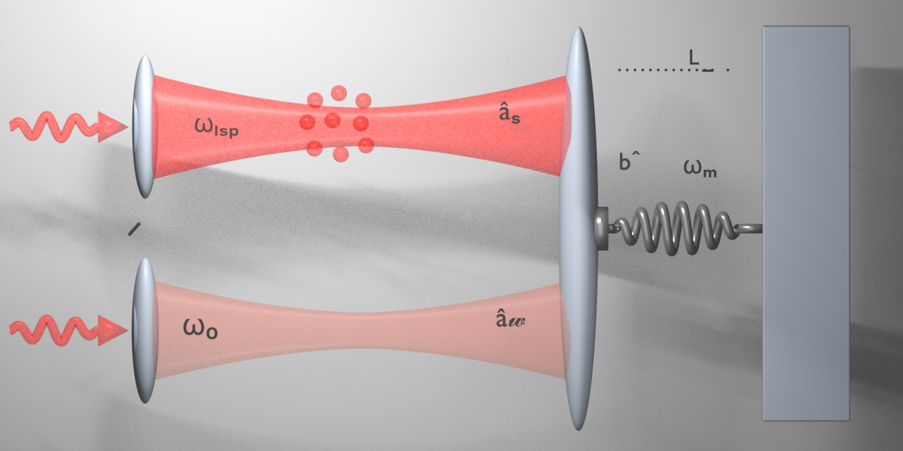

# 3D Optomechanical Cavity Model

A Blender reconstruction of a two-mode optomechanical cavity with a localized surface plasmon region and a shared mechanical oscillator.

  

## Files

- `Python_code_model.py` — Blender Python script used to generate the model
- `Model.blend` — editable Blender scene
- `model_preview.png` — rendered preview
- `reference_article.pdf` — related research article

## Usage

Open `Model.blend` in Blender, or run `Python_code_model.py` from Blender's **Scripting** workspace.

The script creates:

- two optical cavity modes;
- sinusoidal input fields;
- an Ag nanoparticle cluster representing the LSP region;
- a shared movable mirror;
- a mechanical spring connected to a fixed support.

## Reference

M. Dangish et al., “Synchronization of chaotic optomechanical system with plasmonic cavity for secured quantum communication,” *AIP Advances*, 15, 015118 (2025). DOI: 10.1063/5.0241558.

## License

Add your preferred license before redistribution.
